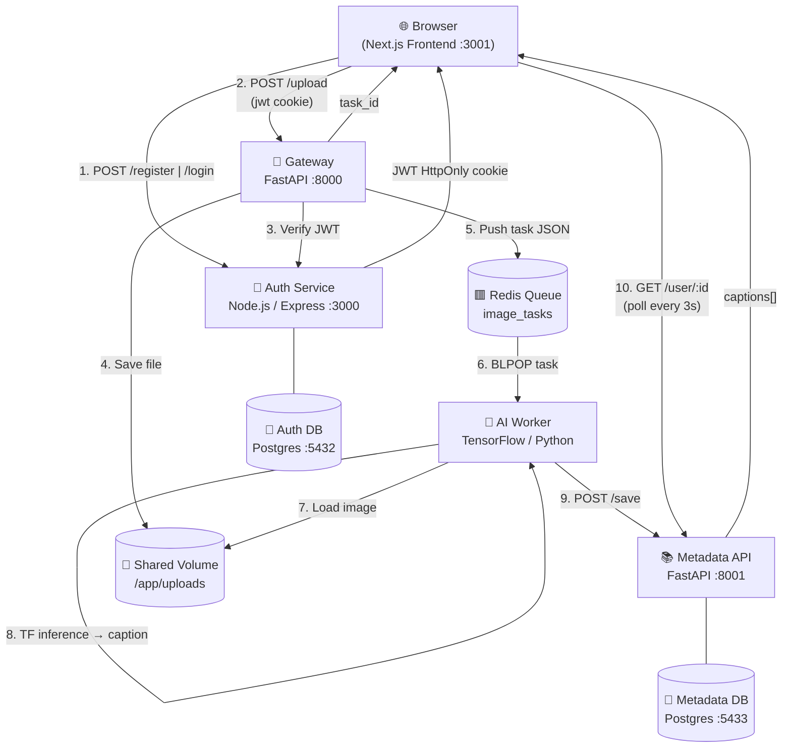

# VisionMetric — AI Image Captioning Platform

A production-grade microservices platform that accepts image uploads and returns AI-generated captions using a custom TensorFlow model. Built for AWS EKS with a full CI/CD pipeline via GitHub Actions.

## Architecture



## Services

| Service | Language | Port | Role |
|---|---|---|---|
| **frontend** | Next.js 14 / TypeScript | 3001 | UI — login, upload, gallery |
| **auth-service** | Node.js / Express | 3000 | JWT auth + HttpOnly cookie sessions |
| **gateway-service** | Python / FastAPI | 8000 | Upload proxy, file storage, Redis producer |
| **ai-worker** | Python / TensorFlow | — | Redis consumer, image captioning |
| **metadata-api** | Python / FastAPI | 8001 | Caption persistence (PostgreSQL) |
| **main-db** | PostgreSQL 15 | 5432 | User accounts |
| **metadata-db** | PostgreSQL 15 | 5433 | Captions |
| **task-queue** | Redis 7 | 6379 | Async task queue |

## Quick Start

```bash
# 1. Clone
git clone https://github.com/your-org/aws-eks-microservices-terraform-cicd.git
cd aws-eks-microservices-terraform-cicd

# 2. Configure environment
cp .env.example .env
# Edit JWT_SECRET in .env

# 3. Start everything (8 containers)
docker compose up --build

# 4. Open the app
open http://localhost:3001
```

All services start, migrate their databases, and are ready in ~60 seconds.

## Environment Configuration

The project uses a layered YAML config system (`config/`) that generates `.env` files for any deployment target:

```bash
# Generate .env for local Docker Compose
python config/generate-env.py local --out .env

# Review EKS config (secrets stay in Kubernetes Secrets / AWS Secrets Manager)
cat config/eks.yml
```

| File | Purpose |
|---|---|
| `config/base.yml` | Shared settings (ports, queue names, file limits) |
| `config/local.yml` | Docker Compose connection strings and dev secrets |
| `config/eks.yml` | Kubernetes/EKS service DNS and S3 storage config |
| `config/generate-env.py` | Merges base + target → produces `.env` |

## Running Tests

```bash
# Auth service (Jest + Supertest — requires Postgres)
cd services/auth-service && npm test

# Gateway (Pytest — fully mocked, no external deps)
cd services/gateaway && pip install -r requirements.txt
pytest tests/ -v

# Metadata API (Pytest + SQLite in-memory)
cd services/metadata-api && pip install -r requirements.txt sqlalchemy[pysqlite]
pytest tests/ -v

# Full end-to-end integration test (requires all services running)
docker compose up -d
pip install httpx pytest
pytest tests/integration/ -v -s --timeout=120
```

## Architecture Decisions

### Redis for Async Decoupling

The Gateway immediately returns a `task_id` to the client after saving the image and pushing a task to Redis. The AI Worker processes the task independently with no HTTP connection held open.

**Why this matters:**
- TensorFlow inference takes 2–10 seconds per image. A synchronous HTTP call would block the gateway, exhaust worker threads, and time out under load.
- Redis RPUSH/BLPOP gives O(1) enqueue/dequeue, enabling horizontal scaling of workers without changing the Gateway.
- The queue survives brief worker restarts — in-flight tasks are re-processed, not lost.

### Separate PostgreSQL Instances

Auth and Metadata data live in completely separate databases (`auth_db` on port 5432, `metadata_db` on port 5433), managed by different services.

**Why this matters:**
- **Blast radius containment:** A Metadata DB migration failure or corruption cannot affect login/registration.
- **Independent scaling:** The Metadata DB grows linearly with AI throughput; Auth DB grows with user registration (much slower). Separate instances allow right-sizing.
- **Team autonomy:** Each service team owns their schema. No cross-service DB dependencies or shared migration scripts.
- **EKS mapping:** Each DB maps to a separate RDS instance in production, with its own connection pool, backup schedule, and IAM policy.

### Next.js Proxy for Security

The frontend never exposes backend URLs to the browser. All API calls go through Next.js server-side API routes (`/api/auth/*`, `/api/gateway/*`, `/api/metadata/*`) which:
1. Forward the `jwt` HttpOnly cookie correctly across domains
2. Add server-side IDOR protection (e.g. a user cannot fetch another user's captions)
3. Allow backend URLs to use internal Docker DNS names, never reaching the browser

### HttpOnly Cookies over localStorage

JWT tokens are stored exclusively in HttpOnly cookies set by the Auth Service. This eliminates the XSS attack surface — no JavaScript running in the page can read the token.

## CI/CD Pipeline

Each service has its own GitHub Actions workflow triggered only when its files change:

| Workflow | Trigger | Steps |
|---|---|---|
| `auth-ci.yml` | `services/auth-service/**` | Node 20, `npm ci`, Postgres service, `npm test` |
| `metadata-ci.yml` | `services/metadata-api/**` | Python 3.11, `pip install`, `pytest` |
| `frontend-ci.yml` | `services/frontend/**` | Node 20, `npm ci`, type-check, `next build` |

## Project Structure

```
.
├── config/                    # Layered YAML config + env generator
├── infra/local/               # Local Postgres init scripts
├── services/
│   ├── auth-service/          # Node.js — JWT auth
│   ├── gateaway/              # FastAPI — upload proxy
│   ├── ai-worker/             # Python — TF image captioning
│   ├── metadata-api/          # FastAPI — caption storage
│   └── frontend/              # Next.js — UI
├── tests/integration/         # End-to-end flow tests
├── docker-compose.yml         # Full local stack
└── .github/workflows/         # Per-service CI pipelines
```

## License

MIT
