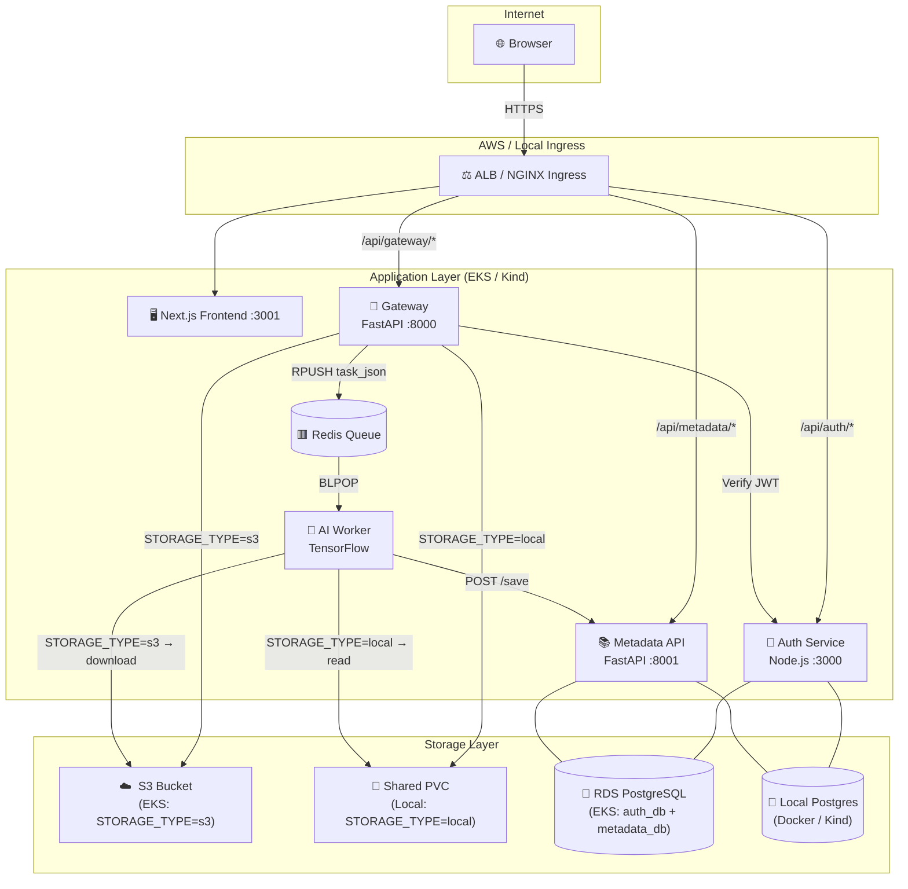

# VisionMetric — AI Image Captioning Platform

A production-grade microservices platform that accepts image uploads and returns AI-generated captions via a custom TensorFlow model. Deployable locally with Docker Compose/Kind **or** fully on AWS EKS with a single `git push`.

---

## System Architecture



### How Local and Cloud Coexist

| Concern | Local (Docker Compose / Kind) | Cloud (AWS EKS) |
|---|---|---|
| **Image storage** | `STORAGE_TYPE=local` → shared PVC at `/app/uploads` | `STORAGE_TYPE=s3` → S3 bucket via IRSA |
| **Databases** | Two Postgres containers (auth-db, metadata-db) | Single `db.t3.micro` RDS with logical `auth_db` + `metadata_db` databases |
| **Credentials** | `.env` file / K8s Secrets with dev values | IAM Roles for Service Accounts (IRSA) — zero hardcoded keys |
| **Ingress** | NGINX Ingress Controller (`k8s/ingress.yaml`) | AWS ALB via Load Balancer Controller (`k8s/ingress-alb.yaml`) |
| **Redis** | Docker Compose service / K8s Deployment | K8s Deployment (in-cluster, no ElastiCache to save cost) |
| **CI trigger** | `k8s-validation.yml` on feature branches | `deploy-aws.yml` on push to `main` |

The Python code switches between storage backends using a single environment variable:
```python
if settings.STORAGE_TYPE == "s3":
    # uploads to S3 via aioboto3 (gateway) / downloads via boto3 (ai-worker)
else:
    # reads/writes /app/uploads on shared PVC
```

---

## Services

| Service | Language | Port | Role |
|---|---|---|---|
| **frontend** | Next.js 14 / TypeScript | 3001 | UI — login, upload, caption gallery |
| **auth-service** | Node.js / Express | 3000 | JWT auth, HttpOnly cookie sessions |
| **gateway-service** | Python / FastAPI | 8000 | Upload proxy, file storage, Redis producer |
| **ai-worker** | Python / TensorFlow | — | Redis consumer, image captioning inference |
| **metadata-api** | Python / FastAPI | 8001 | Caption persistence (PostgreSQL) |
| **Redis** | Redis 7 | 6379 | Async task queue |
| **Postgres (local)** | PostgreSQL 15 | 5432 / 5433 | Auth DB + Metadata DB |
| **RDS (AWS)** | PostgreSQL 15 | 5432 | Single instance, two logical databases |

---

## Local Development (Docker Compose)

### Prerequisites

- Docker Desktop ≥ 4.x
- `git`, `make` (optional)

### Quick Start

```bash
# 1. Clone
git clone https://github.com/your-org/aws-eks-microservices-terraform-cicd.git
cd aws-eks-microservices-terraform-cicd

# 2. Configure
cp .env.example .env
# Edit .env — set JWT_SECRET to any random string

# 3. Start all 8 containers
docker compose up --build

# 4. Open app
open http://localhost:3001
```

All services are ready in ~60 seconds. The AI Worker loads the TensorFlow model on first start.

### Running Tests

```bash
# Auth (Jest + Supertest — spins up Postgres)
cd services/auth-service && npm test

# Gateway (Pytest — fully mocked, no external deps)
cd services/gateaway && pip install -r requirements.txt && pytest tests/ -v

# Metadata API (Pytest + SQLite in-memory)
cd services/metadata-api && pip install -r requirements.txt && pytest tests/ -v

# Full end-to-end (requires all services running)
docker compose up -d
pip install httpx pytest
pytest tests/integration/ -v -s --timeout=120
```

---

## Local Kubernetes (Kind)

The `k8s-validation.yml` workflow validates the full K8s stack on every PR:

```bash
# Manual validation (requires kind + kubectl)
kind create cluster --config .github/kind-config.yaml --name local
kubectl apply -f https://raw.githubusercontent.com/kubernetes/ingress-nginx/controller-v1.10.0/deploy/static/provider/kind/deploy.yaml

docker build -t auth-service:latest     ./services/auth-service
docker build -t gateway-service:latest  ./services/gateaway
docker build -t ai-worker:latest        ./services/ai-worker
docker build -t metadata-api:latest     ./services/metadata-api
docker build -t frontend:latest         ./services/frontend

kind load docker-image auth-service:latest gateway-service:latest \
  ai-worker:latest metadata-api:latest frontend:latest --name local

kubectl apply -f k8s/auth/secret.yaml
kubectl apply -f k8s/metadata-api/secret.yaml
kubectl apply -f k8s/shared/
kubectl apply -f k8s/auth/
kubectl apply -f k8s/gateway/
kubectl apply -f k8s/ai-worker/
kubectl apply -f k8s/metadata-api/
kubectl apply -f k8s/frontend/
kubectl apply -f k8s/ingress.yaml
```

---

## Cloud Deployment (AWS EKS)

### Prerequisites

- AWS account with permissions for: EKS, EC2, RDS, S3, ECR, IAM, VPC
- Terraform ≥ 1.6
- `aws-cli` v2 configured (`aws configure`)
- `kubectl`, `helm`

### Step 1 — Provision Infrastructure

```bash
cd terraform

# Copy and fill in variables
cp terraform.tfvars.example terraform.tfvars
# Edit terraform.tfvars: set db_password to a strong value

terraform init
terraform plan -out=tfplan
terraform apply tfplan
```

Terraform provisions:
- **VPC** with 2 public + 2 private subnets across 2 AZs, 1 NAT Gateway
- **EKS** cluster (`visionmetric-eks`) with 2× `t3.medium` managed nodes
- **RDS** `db.t3.micro` PostgreSQL (Free Tier) — `auth_db` + `metadata_db`
- **S3** bucket for image uploads with AES256 encryption
- **ECR** repositories for all 5 services (5-image lifecycle policy)
- **IRSA** IAM role granting gateway + ai-worker S3 access (no static keys)
- **ALB Controller** IAM role for K8s ingress

Capture outputs for CI/CD secrets:
```bash
terraform output -json
```

### Step 2 — Configure GitHub Actions Secrets

In your GitHub repository → Settings → Secrets → Actions, add:

| Secret | Value (from `terraform output`) |
|---|---|
| `AWS_ACCESS_KEY_ID` | CI/CD IAM user access key |
| `AWS_SECRET_ACCESS_KEY` | CI/CD IAM user secret key |
| `RDS_ENDPOINT` | `terraform output -raw rds_endpoint` |
| `DB_USERNAME` | Value of `var.db_username` in tfvars |
| `DB_PASSWORD` | Value of `var.db_password` in tfvars |
| `JWT_SECRET` | A strong random string (≥32 chars) |
| `S3_BUCKET` | `terraform output -raw s3_bucket_name` |
| `IRSA_ROLE_ARN` | `terraform output -raw irsa_role_arn` |
| `ALB_CONTROLLER_ROLE_ARN` | From `terraform output` → `eks` module alb role |

### Step 3 — Deploy

```bash
git push origin main
```

The `deploy-aws.yml` workflow:
1. Builds all Docker images and pushes to ECR (tagged with commit SHA)
2. Configures `kubectl` for the EKS cluster
3. Creates the `visionmetric` namespace
4. Installs AWS Load Balancer Controller via Helm
5. Creates K8s Secrets from GitHub Actions secrets
6. Annotates the `visionmetric-worker` service account with the IRSA role ARN
7. Overrides ConfigMaps with EKS values (`STORAGE_TYPE=s3`, RDS endpoints, S3 bucket)
8. Creates `metadata_db` on RDS (idempotent K8s Job)
9. Applies all manifests with ECR image URLs
10. Waits for all Deployment rollouts
11. Prints the ALB DNS hostname

Access your application at the printed URL:
```
✅ Application URL: http://visionmetric-eks-XXXXX.us-east-1.elb.amazonaws.com
```

### Tearing Down (No Surprise Charges)

```bash
# 1. Delete K8s resources (removes ALB and EBS volumes first)
aws eks update-kubeconfig --region us-east-1 --name visionmetric-eks
kubectl delete namespace visionmetric
kubectl delete -f k8s/ingress-alb.yaml --ignore-not-found

# Wait ~2 min for ALB/ENI cleanup
sleep 120

# 2. Destroy all Terraform resources
cd terraform && terraform destroy
```

> **Important:** Always delete K8s resources before `terraform destroy`. ALBs and EBS volumes
> provisioned by Kubernetes controllers are not tracked in Terraform state and will block VPC deletion.

---

## Infrastructure Overview

```
terraform/
├── provider.tf             # AWS provider, required versions
├── variables.tf            # All input variables with defaults
├── main.tf                 # Root module wiring
├── outputs.tf              # Key outputs (cluster name, ECR URLs, etc.)
├── terraform.tfvars.example
└── modules/
    ├── vpc/                # VPC, 2 public + 2 private subnets, 1 NAT GW
    ├── eks/                # EKS cluster, managed node group, OIDC provider
    │   └── alb-controller-policy.json
    ├── rds/                # db.t3.micro PostgreSQL, private subnet
    ├── s3/                 # Uploads bucket, SSE, lifecycle to IA/Glacier
    ├── ecr/                # 5 repos, lifecycle policy (keep 5 images)
    └── irsa/               # IAM role for visionmetric-worker K8s SA
```

---

## Cost Management

### Monthly Estimate (AWS Free Tier, us-east-1)

| Resource | Type | Estimated Cost |
|---|---|---|
| EKS Control Plane | — | **$73/month** |
| EC2 Worker Nodes | 2× t3.medium | ~$60/month (On-Demand) |
| RDS PostgreSQL | db.t3.micro | **Free Tier** (750h/month for 12mo) |
| S3 Storage | 5 GB | **Free Tier** (5 GB/month for 12mo) |
| NAT Gateway | 1× | ~$32/month + $0.045/GB |
| ALB | 1× | ~$16/month + LCU charges |
| ECR Storage | 5 repos, 5 images | ~$0.10/month |
| **Total** | | **~$180/month** |

> After Free Tier: ~$220/month total.

### FinOps Decisions

| Decision | Monthly Saving | Trade-off |
|---|---|---|
| 1 NAT Gateway instead of 3 | ~$64/month | Single AZ egress — AZ failure loses outbound |
| Redis in K8s (not ElastiCache) | ~$25/month | No replication, tasks lost on pod restart |
| Single RDS for auth + metadata | ~$15/month | Noisy-neighbour risk between services |
| 2 nodes max, no cluster autoscaler | Capped EC2 bill | Manual scaling required for traffic spikes |
| S3 lifecycle to GLACIER after 90d | Storage savings | 90-day access delay for old images |

### Destroying Infrastructure

Every resource is configured for clean destruction:
- `aws_s3_bucket.force_destroy = true` — empties bucket before deletion
- `aws_ecr_repository.force_delete = true` — deletes all images
- `aws_db_instance.skip_final_snapshot = true` — no orphaned snapshot
- `aws_db_instance.deletion_protection = false` — allows destroy

---

## CI/CD Pipelines

| Workflow | Trigger | Purpose |
|---|---|---|
| `auth-ci.yml` | `services/auth-service/**` | Jest + Postgres integration tests |
| `gateway-ci.yml` | `services/gateaway/**` | Pytest (fully mocked) |
| `metadata-ci.yml` | `services/metadata-api/**` | Pytest + SQLite in-memory |
| `frontend-ci.yml` | `services/frontend/**` | TypeScript check + Next.js build |
| `k8s-validation.yml` | PRs to `main`, `feature/k8s-*` | Full Kind cluster smoke test |
| `deploy-aws.yml` | Push to `main` | Build → ECR → EKS deploy |

---

## Architecture Decisions

### Redis for Async Decoupling
TensorFlow inference takes 2–10 seconds. A synchronous HTTP call would block gateway threads and time out under load. Redis RPUSH/BLPOP gives O(1) enqueue/dequeue, and the queue survives worker restarts without losing in-flight tasks.

### Hybrid Storage (Local PVC / S3)
The `STORAGE_TYPE` environment variable switches the storage backend at runtime. Local mode uses a shared PVC for Docker Compose and Kind validation. Cloud mode uses S3 with IRSA — no AWS credentials appear in any configuration file or environment variable.

### IRSA (IAM Roles for Service Accounts)
The gateway and ai-worker pods share the `visionmetric-worker` Kubernetes service account, which is annotated with an IAM role ARN. The EKS OIDC provider validates the pod's JWT and exchanges it for temporary AWS credentials scoped to S3 only. This eliminates the entire class of leaked-credentials incidents.

### Single RDS Instance
Two logical PostgreSQL databases (`auth_db`, `metadata_db`) run on one `db.t3.micro` instance instead of two. This halves the RDS cost while preserving the logical isolation that prevents cross-service SQL access. For traffic beyond the Free Tier, the two databases can be migrated to separate instances with no application code changes.

### Next.js Proxy for Security
All API calls go through Next.js server-side route handlers, which forward `HttpOnly` cookies and enforce IDOR protection. Backend URLs (auth-service, gateway, metadata-api) never reach the browser, preventing SSRF and enumeration attacks.

---

## Project Structure

```
.
├── terraform/                  # IaC — complete AWS infrastructure
│   └── modules/{vpc,eks,rds,s3,ecr,irsa}/
├── k8s/                        # Kubernetes manifests (local + cloud)
│   ├── auth/                   # Auth service + auth-db (local only)
│   ├── gateway/                # Gateway service + IRSA service account
│   ├── ai-worker/              # AI worker + IRSA service account
│   ├── metadata-api/           # Metadata API + metadata-db (local only)
│   ├── frontend/               # Next.js deployment
│   ├── shared/                 # Redis, shared PVC
│   ├── ingress.yaml            # NGINX ingress (Kind / local)
│   └── ingress-alb.yaml        # ALB ingress (AWS EKS)
├── services/
│   ├── auth-service/           # Node.js / Express JWT auth
│   ├── gateaway/               # FastAPI upload proxy (S3 + local)
│   ├── ai-worker/              # TensorFlow captioning worker (S3 + local)
│   ├── metadata-api/           # FastAPI caption storage
│   └── frontend/               # Next.js 14 UI
├── config/                     # Layered YAML config system
├── infra/local/                # Postgres init SQL (Docker Compose)
├── tests/integration/          # End-to-end flow tests
├── docker-compose.yml          # Full local stack (8 containers)
└── .github/workflows/          # CI/CD — per-service + K8s + AWS deploy
```

---

## License

MIT
